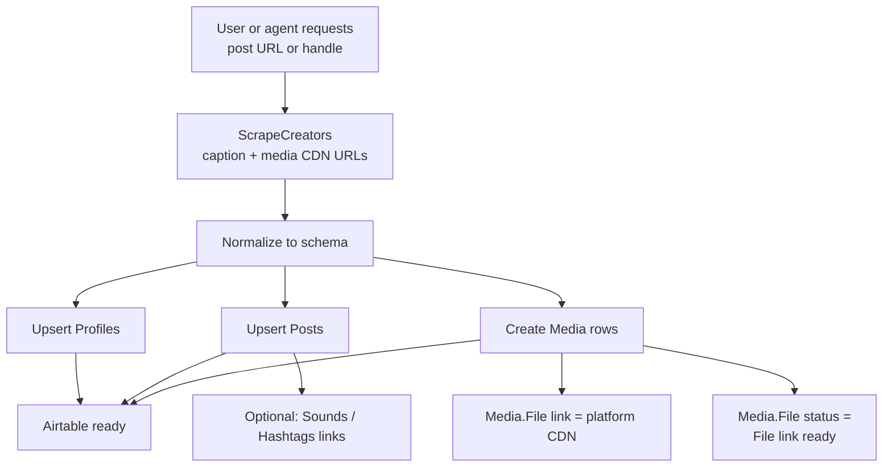
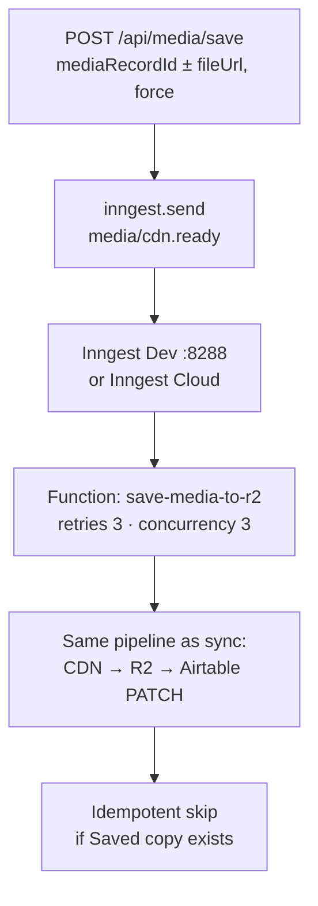
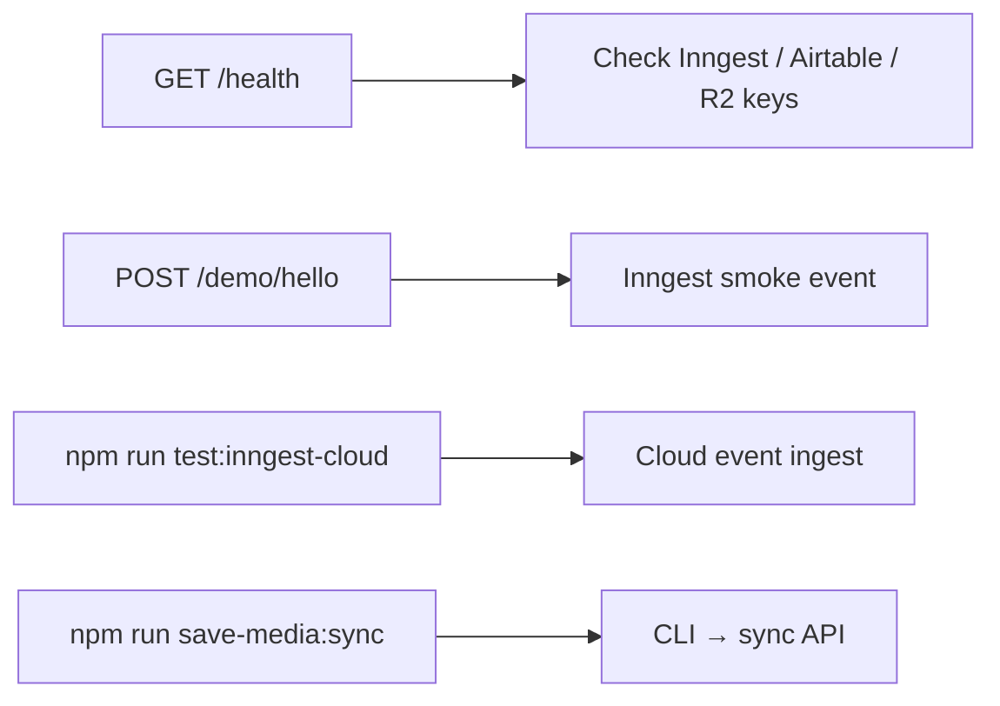
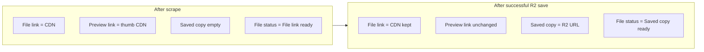
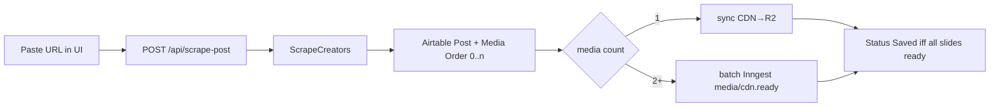

# Social Hub — current workflows

Exact flowcharts for what exists today (`social-hub` + Airtable base `appkPrLfwDGwIIbTL`).

---

## End-to-end happy path

```mermaid
flowchart LR
  A[Request: post URL / handle] --> B[ScrapeCreators API]
  B --> C[Normalize fields]
  C --> D[Upsert Airtable<br/>Profiles / Posts / Media]
  D --> E{Save mode}
  E -->|sync| F[POST /api/media/save-sync]
  E -->|async| G[POST /api/media/save]
  G --> H[Inngest event<br/>media/cdn.ready]
  H --> I[save-media-to-r2]
  F --> J[Download CDN File link]
  I --> J
  J --> K[Upload Cloudflare R2]
  K --> L[PATCH Media<br/>Saved copy = R2 URL]
  L --> M[File status:<br/>Saved copy ready]
  M --> N[Optional: Post Status = Saved]

  style D fill:#1e3a5f,color:#fff
  style K fill:#1e3a5f,color:#fff
  style L fill:#1e3a5f,color:#fff
```



---

## Workflow A — Scrape post → Airtable

> Still **manual / agent / script** today. No single `POST /api/scrape-post` yet.



### Airtable writes

| Table | Key fields |
|-------|------------|
| Profiles | Handle, Platform, Followers, Verified |
| Posts | Post ID, Text, Link, Stats, Status |
| Media | File link (CDN), Preview, Type, Order |
| Sounds / Hashtags | Optional Topics / Sound links |

---

## Workflow B — CDN → R2 → Saved copy

### B1 — Sync (standalone, no Inngest)

```mermaid
flowchart TD
  B1[POST /api/media/save-sync<br/>mediaRecordId ± fileUrl, force] --> B2[Load Media from Airtable]
  B2 --> B3{Saved copy exists<br/>and force = false?}
  B3 -->|yes| B4[Skip: already-saved]
  B3 -->|no| B5[Read File link CDN URL]
  B5 --> B6[Download CDN bytes]
  B6 --> B7[Upload R2<br/>key: social-hub/{mediaId}/{ts}.ext]
  B7 --> B8[PATCH Media]
  B8 --> B9[File link unchanged CDN]
  B8 --> B10[Saved copy = R2 public URL]
  B8 --> B11[File status = Saved copy ready]
  B8 --> B12{postRecordId?}
  B12 -->|yes| B13[PATCH Post<br/>Status = Saved]
  B12 -->|no| B14[Done]
  B13 --> B14
```

CLI: `npm run save-media:sync -- --id rec…`

### B2 — Async (Inngest queue)



CLI: `npm run save-media -- --id rec…`

---

## Workflow C — Health / smoke



---

## Media field contract



| Field | Owner | After successful save |
|-------|--------|------------------------|
| File link | Platform CDN | Unchanged (kept) |
| Saved copy | Our R2 | Public R2 URL set |
| File status | Pipeline | `Saved copy ready` |
| Preview link | Platform thumb | Usually unchanged |

---

## Gap

Carousel / multi-media: see [docs/carousel.md](docs/carousel.md).



UI: open `http://127.0.0.1:8787/` with `npm run dev:api`.
