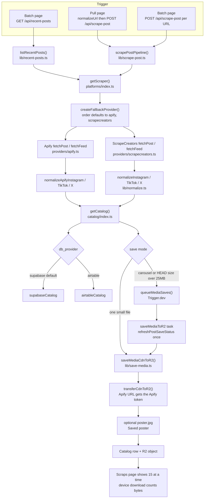
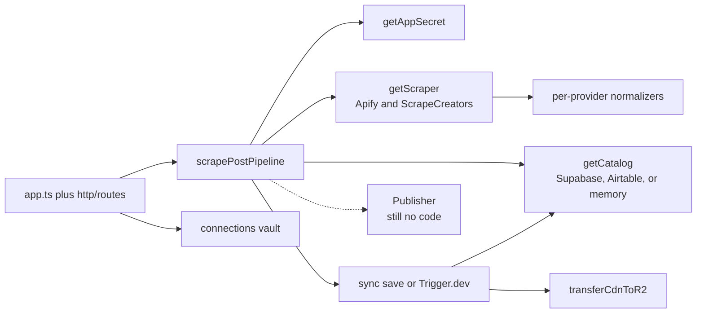

# Architecture review

Updated 6 Oct 2026, after `main` moved on 4–5 Oct. This replaces the 4 Oct write-up. It describes the code that is on `main` now.

No application code was changed for this update. The only edited file is this document.

Words used the same way every time:

- An **API** is a program you talk to over the network.
- A **route** is one URL on that API, such as `POST /api/scrape-post`.
- An **environment variable** is a named setting supplied at startup. This doc lists names only.
- A **provider** is one implementation behind a shared door. The scrape door has two providers. The catalog door has three.
- A **vault** is the encrypted store for those settings (Cloudflare D1, a small SQL database on the Worker).
- A **CDN URL** is the temporary file link on Instagram, TikTok, or X. Those links expire.
- **Upsert** means "update the row if it exists, otherwise create it."

`SCRAPING-PROVIDERS.md` and `docs/modules.md` were written before this split. They still describe a single ScrapeCreators key and a flat `src/lib` folder. Trust this file, and the source, over those two notes.

---

## 1. The system from the root

### What it does

You paste a post link, or you pick posts from a profile. The API asks a scrape provider for the post, turns the answer into one shared shape, writes rows to a catalog, and copies the video or image onto Cloudflare R2.

The default scrape provider is **Apify**. If that call fails in a way the fallback code treats as "try the next one," the API tries **ScrapeCreators**. You can change that order in the vault (`scrape_order`, or the older `scrape_provider`). Auto-switch is on unless `scrape_auto_switch` is `off`.

The default catalog is **Supabase** (Postgres reached over HTTP). **Airtable** is still a full second catalog. A third, `memory`, exists for tests. Switching `DB_PROVIDER` does not copy rows. Scripts under `apps/api/scripts/` can migrate and compare.

Posting the saved file out to your own social accounts is still not built.

### Top-level map

| Path | What it is |
| --- | --- |
| `apps/api` | The backend. HTTP, scrape, catalog, R2, vault, background save. |
| `apps/api/src/index.ts` | Local entry. Loads the repo `.env`, then `apps/api/.dev.vars`. Listens on port `8787`. |
| `apps/api/src/worker.ts` | Internet entry. Cloudflare runs this file. |
| `apps/api/src/app.ts` | Most product routes, plus the old HTML pages. |
| `apps/api/src/platforms` | Scrape providers and the fallback switch. |
| `apps/api/src/catalog` | Catalog providers: Supabase, Airtable, memory. |
| `apps/api/src/connections` | Vault: encrypt, store, inherit, issue tokens. |
| `apps/api/src/http/routes` | Routes for settings, connections, and vault tokens. |
| `apps/api/src/lib` | Pipeline pieces that have not moved yet: save, R2, scraps, usage, the old ScrapeCreators HTTP client. |
| `apps/api/src/trigger/save-media-to-r2.ts` | The Trigger.dev job that copies a file. |
| `apps/api/src/workflows/save-media.ts` | A Cloudflare Workflow class. No route starts it. |
| `apps/api/migrations` | D1 tables for the vault (`connections`, tokens, links, usage). |
| `apps/api/supabase/migrations` | Catalog tables (`posts`, `media`, `profiles`) and usage events. |
| `apps/api/public` | Older plain HTML/JS pages. |
| `apps/web` | React admin. Routes include Pull, Batch, Scraps, Usage, Settings, Secrets (`/connections`), Docs. |
| `packages/shared` | A tiny type file. The apps still do not import it. |
| `scripts` | One-off commands, including `scripts/test-vault-auth.mjs`. |
| `fixtures/scrapecreators` | Saved ScrapeCreators bodies for offline runs. |

Local start is still `npm run dev` (API on 8787, admin on 5173). Deploy is still `npm run cf:deploy`: build the admin site into `apps/api/public/admin`, then `wrangler deploy`. The Worker serves the new UI at `/admin/`.

### Env var names

The vault can override these. `getAppSecret()` reads the vault row first, then the environment variable. A deleted vault row falls back to the environment again.

| Name | Used for |
| --- | --- |
| `PORT` | Local API port. Default `8787`. |
| `RUNTIME` | Set to `cloudflare` inside the Worker. |
| `MASTER_KEY` | Encrypts vault values. Required on the Worker. Not in `.env.example`. |
| `APIFY_TOKEN` | Apify. Vault name `apify`. |
| `SCRAPECREATORS_API_KEY` | ScrapeCreators. Vault name `scrapecreators`. |
| `SC_MODE` | `cache`, `offline`, or `live`. The Worker forces live. |
| `SC_VENDOR_CACHE_HOURS` | Sent as `cache_max_age` on ScrapeCreators calls. |
| `SC_FIXTURE` | Force one file under `fixtures/scrapecreators/`. |
| `SC_CACHE_WRITE` | `0` turns off the local response cache. |
| `DB_PROVIDER` | `supabase` (default), `airtable`, or `memory`. |
| `SUPABASE_URL` | Catalog host. |
| `SUPABASE_SECRET_KEY` | Catalog writes. |
| `SUPABASE_PUBLISHABLE_KEY` | Present in the vault catalog. |
| `SUPABASE_JWKS_URL` | Listed in `.env.example`. The catalog client uses the secret key. |
| `AIRTABLE_TOKEN` or `AIRTABLE_API_KEY` | Airtable, when that catalog is selected. |
| `AIRTABLE_BASE_ID` | Airtable base. |
| `AIRTABLE_POSTS_TABLE`, `AIRTABLE_MEDIA_TABLE`, `AIRTABLE_PROFILES_TABLE` | Table ids. |
| `AIRTABLE_USAGE_EVENTS_TABLE` | Optional Airtable usage log. |
| `R2_ACCOUNT_ID`, `R2_ACCESS_KEY_ID`, `R2_SECRET_ACCESS_KEY` | R2 login. |
| `R2_BUCKET` | Bucket. Default `scrape-kit-media`. |
| `R2_PUBLIC_BASE_URL` | Public base for saved files. |
| `TRIGGER_SECRET_KEY` | Trigger.dev. |
| `LIBRARY_BUST_URL`, `LIBRARY_BUST_SECRET` | Clear the scraps cache after a save. |
| `VITE_BASE` | Admin build prefix. Deploy uses `/admin/`. |

`.env.example` still lists `COMPOSIO_API_KEY`, `COMPOSIO_USER_ID`, and `COMPOSIO_AIRTABLE_ACCOUNT_ID`. No application code reads them.

Vault-only names (not env vars) include `scrape_order`, `scrape_provider`, `scrape_auto_switch`, and optional actor overrides `apify_actor_instagram`, `apify_actor_tiktok`, `apify_actor_x`.

Wrangler binds a D1 database named `social-hub-connections` as `DB`, plus the existing `LIBRARY_KV` cache. `scripts/cf-deploy-secrets.sh` still does not upload `SC_VENDOR_CACHE_HOURS` or `MASTER_KEY`. `MASTER_KEY` has to be set as a Worker secret or the vault cannot decrypt.

### Outside services

| Service | Role | Where |
| --- | --- | --- |
| Apify (`https://api.apify.com`) | Default scraper. Runs an Actor and reads the dataset. Usage is monthly USD, not credits. | `platforms/providers/apify.ts` |
| ScrapeCreators (`https://api.scrapecreators.com`) | Second scraper. Bills credits. A vendor cache hit can cost 0. | `lib/scrapecreators.ts`, wrapped by `platforms/providers/scrapecreators.ts` |
| Supabase | Default catalog (profiles, posts, media) and an optional usage table. | `catalog/providers/supabase.ts` |
| Airtable | The other catalog. Same function list. | `catalog/providers/airtable.ts` |
| Cloudflare D1 | Vault of encrypted settings, project links, and vault tokens. | `connections/` |
| Cloudflare R2 | Permanent media files. | `lib/r2.ts` |
| Trigger.dev | Queue for multi-file and large saves. | `lib/queue-media-save.ts`, `trigger/save-media-to-r2.ts` |
| Cloudflare Workers + KV | Hosts the API. KV holds a 60-second scraps snapshot. | `worker.ts`, `lib/library-cache.ts` |

Default Apify Actors:

| Platform | Actor |
| --- | --- |
| Instagram | `apify/instagram-scraper` |
| TikTok | `clockworks/tiktok-scraper` |
| X | `apidojo/tweet-scraper` |

---

## 2. Data flow

Step by step for one pasted URL:

1. The Pull page runs `normalizeUrl()` (`apps/web/src/lib/normalize-url.ts`). That pulls the first `http` link out of a share blurb, unwraps Instagram login and `l.instagram.com` wrappers, and drops tracking query params (`igsh`, `utm_*`, TikTok `_r` / `_t`, and similar).
2. `POST /api/scrape-post` calls `scrapePostPipeline()`.
3. `getScraper()` reads `scrape_order` from the vault. With nothing stored, the order is Apify, then ScrapeCreators, with auto-switch on.
4. `createFallbackProvider()` calls `fetchPost` on the first provider. Some failures try the next provider. A missing post does not.
5. The winner returns a `NormalizedScrape` (`lib/types.ts`), including `providerUsed` and `fallbackUsed`.
6. `getCatalog()` writes profile, post, and media. Default database is Supabase. The post field `Post scraper` is the fallback chain's combined name (`apify,scrapecreators`), not only the provider that won. The winning name is on the scrape result as `provider_used`.
7. One small file is copied in the HTTP request. Several files, or one file whose `HEAD` says it is over 25MB, go to Trigger.dev. If the queue call fails, the post is marked `Queue failed` and the request returns. It does not download the slides inside that same request anymore.
8. `transferCdnToR2()` downloads the CDN URL. If the host is exactly `api.apify.com`, the request adds `Authorization: Bearer` and the Apify token. That is how an Apify-hosted video or cover can be fetched.
9. For a video, `saveVideoPoster()` copies `Preview link` to R2 at `social-hub/{mediaId}/poster.jpg` and stores that URL in `Saved poster`. The scraps library shows that hosted poster, not the platform cover.
10. The scraps screen (`apps/web/src/pages/scraps.tsx`) reveals 15 posts at a time. Saving a file to the device uses `downloadWithProgress()` (`apps/web/src/lib/download-file.ts`), which counts bytes as they arrive. The default save action is `download` (`lib/prefs.ts`).

There is still no publisher after the file lands on R2.

---

## 3. What is broken, fixed, or new

### Earlier problems

| 4 Oct finding | Now |
| --- | --- |
| Public scrape, library, and media routes have no login. | **Still present.** The new vault routes make it worse. See below. |
| `scGet()` has no timeout, no retry, and accepts `success: false`. | **Changed, not fixed.** ScrapeCreators `scGet()` (`lib/scrapecreators.ts`, about lines 66–109) is the same: no timeout, no retry, HTTP status only. The new fallback sits *around* providers. It does not repair `scGet()`. The Instagram fixture `fixtures/scrapecreators/last-ig-raw.json` is still `{ success: false, error: "bad_request" }`. Nothing in `normalize.ts` checks `success`. |
| Re-scrape sets `saveStatus` back to `pending`, so a saved file downloads again. Dead CDN links refresh only when `mediaOnly` is set. | **Still present.** `scrape-post.ts` still writes `saveStatusFields("pending")` on every upsert. `save-media.ts` still refreshes the file URL only when `mediaOnly` is true. The Trigger.dev task does not set `mediaOnly`. |
| `HEAD` failure looks like a small file, so a big video stays on the sync path. | **Still present.** `headCdnUrl()` still returns `{}` on error. The 25MB check treats a missing length as 0. |
| Profile feeds are one page. Batch ignores cursors. X is a sample. | **Changed.** ScrapeCreators still returns `nextCursor` for Instagram and TikTok, and still has no X cursor. Apify `fetchFeed` does not take the cursor and always asks for 24 items. The default provider is Apify, so the feed you get by default is one Apify page. Batch still never sends `cursor`. The X "sample feed" note is still attached whenever the platform is X, including when Apify answered. |
| Two parsers, and a missing id becomes `"unknown"`. | **Changed.** Apify has its own normalizers in `providers/apify.ts`. ScrapeCreators still has `normalize.ts` for a single post and a second set of mappers inside `providers/scrapecreators.ts` for the feed. Both sides can still emit post id `"unknown"`. |
| The library stops after the first Airtable page. | **Changed, mostly still true.** The UI adds 15 posts at a time (`FEED_PAGE_SIZE` in `scraps.tsx`). That slice is taken from whatever `GET /api/scraps` already returned. `listScraps()` still calls `listPosts(80)`, `listMedia(100)`, and `listProfiles(100)`. Supabase `listPosts` / `listMedia` / `listProfiles` use one `limit` and do not loop. `fetchAllRows()` does loop, and the migration script uses that. The gallery does not. |
| Inngest docs, an unused Cloudflare Workflow, and Trigger.dev all describe the save. | **Still present.** Trigger.dev is the live queue. `workflows/save-media.ts` is still unused. `WORKFLOWS.md`, `docs/api.md`, and the comment on `saveMode` in `scrape-post.ts` still say Inngest. `POST /api/inngest` and `POST /demo/hello` are still gone. |
| Async queue failure fell back to a sync download inside the HTTP request. | **Fixed.** A failed `queueMediaSaves()` now sets status `Queue failed` and returns `reason: "queue_failed"`. The Trigger.dev task writes post status once in a `finally` block, instead of once per slide. |
| Thumb host check uses `includes("tiktok.com")`. | **Still present** in `app.ts` `isAllowedThumbHost`. |
| Airtable formulas escape quotes only. | **Still present** in `catalog/providers/airtable.ts` `formulaEq`, used when `db_provider` is `airtable`. |
| Resource ids are committed. No API tokens were found in git. | **Still true.** Airtable ids remain in `wrangler.jsonc` and `.env.example`. `wrangler.jsonc` now also commits the D1 database id. `r2.ts` still falls back to a hardcoded public R2 host when `R2_PUBLIC_BASE_URL` is empty. |
| Usage "credits used" is one page of history. | **Still present** for ScrapeCreators, inside `createScrapeCreatorsProvider().getCredits()` (`getCreditUsage(1)`). Apify usage is a separate monthly USD total from `apifyUsageTotals()`. |
| `createApp()` runs on every Worker request, so the in-flight scraps map does not dedupe. | **Still present** (`worker.ts`). |
| Local disk cache never expires. Production is always live and does not send `SC_VENDOR_CACHE_HOURS` unless you set it. | **Still present.** |
| No automated tests. `tsc` failed on missing Cloudflare types. | **Changed.** `apps/api` has Vitest (`npm test` in that package) and `src/cloudflare.d.ts`. See "What was run." |
| `heic-convert` and `packages/shared` are unused. Composio env names are unused. | **Still true.** |
| No publisher. | **Still true.** |

### New problems

**The vault can hand out secrets with no login.** This is the sharpest change.

These routes are mounted with no shared secret and no user check:

- `GET /api/connections/:project/:name/reveal` decrypts one secret and returns `value`.
- `GET /api/connections/:project/export` returns every decrypted value for a project.
- `PUT /api/connections/:project/bulk` and the other connection writes can replace secrets.
- `POST /api/vault/tokens` creates a vault token. `GET /api/vault/tokens/:id/reveal` returns the token string.

`GET /api/vault/env` is the exception. It requires `Authorization: Bearer` and checks the token hash. That is the inheritance API: a token for project P sees `global`, then each linked project (links are not transitive; a later link overrides an earlier one), then P's own rows. `global` is always included and cannot itself inherit.

The running app does **not** use that link list. `getConnection()` reads the named project, then `global`, then stops. `getAppSecret()` uses that, then the environment variable. So a scrape on the Worker inherits `global` and env, not "linked projects." Linked-project inheritance exists for whoever calls `/api/vault/env`.

List views mask secrets (`maskPreview`). Reveal and export do not.

**Apify is the default, and a fallback can spend twice.** One Actor run waits up to 310 seconds (`runActor` in `apify.ts`). TikTok posts set `shouldDownloadVideos: true`, so Apify stores the video and the cover. A non-JSON HTTP 404 is classified as "try the next provider" (`fallback.ts`, and `fallback.test.ts`). A body that says the post was not found, or "no items," does not fall through. A 401, 402, 403, 429, 5xx, a network error, or a missing key does. Cooldown (10 minutes for 401/402 and a missing key, 1 minute for 429) lives in a process memory map. A second Worker isolate does not see it. Falling through after Apify already ran still costs that Apify run.

**The poster is a copied file named `.jpg`, not a converted JPEG.** `posterSourceUrl()` prefers an `api.apify.com` cover over a TikTok CDN cover. `saveVideoPoster()` uploads those bytes to `poster.jpg`. If the cover is HEIC, the object is still HEIC with a `.jpg` name. `heic-convert` is still unused. A poster failure is logged and the video save still succeeds.

**`@xmldom/xmldom` is imported and not installed.** `lib/r2.ts` imports it so `measureR2Bucket()` can parse S3 list XML. It is not in `apps/api/package.json`. Any module that loads `r2.ts` fails at import time when that package is missing. `src/lib/scraps.test.ts` fails for that reason. `tsc --noEmit` also reports the missing module.

**Apify X picks the highest-bitrate mp4.** `normalizeApifyX` sorts variants by bitrate descending. The older ScrapeCreators helper `pickPracticalMp4` penalizes very high bitrates so day-to-day saves stay smaller. Those two policies disagree. A fallback from one provider to the other can save a different file for the same post.

**Batch "progress" during a scrape is not byte progress.** Scraps' save-to-device path counts real bytes (`downloadWithProgress`). Batch's save loop sets the row to preparing, then jumps to 100% when `POST /api/scrape-post` returns. It still retries that whole request once, immediately, on failure.

### What was run

No live Apify, ScrapeCreators, Supabase, Airtable, R2, or Trigger.dev calls. Nothing was deployed.

| Check | Result |
| --- | --- |
| `npm ci --prefix apps/api` | Installed. npm still reports 19 dependency advisories (1 critical: `tar`, plus highs in toolchain packages). |
| `npm test` in `apps/api` (Vitest) | 9 files passed, 41 tests passed, 1 skipped. `src/lib/scraps.test.ts` failed to load: `Cannot find package '@xmldom/xmldom'`. |
| `tsc --noEmit` in `apps/api` | Failed. Missing `@xmldom/xmldom`. Two errors in `connections/links.test.ts` (empty tuple index). The old `Fetcher` / `cloudflare:workers` errors are gone. |
| `node --test` on `apps/web/src/lib/normalize-url.test.ts` and `download-file.test.ts` | 6 passed. Confirmed: a share blurb becomes a clean Instagram reel URL, TikTok and X short hosts stay, percent is null when `Content-Length` is missing. |

---

## 4. Modules, and what to do next

The 4 Oct plan asked for a source adapter, a normalizer, a repository, a media store, a scheduler, an orchestrator, publishers, and config. Part of that now exists. The doors are real. Several rooms behind them are still shared.

### What each module is today

**Config and vault** (`connections/`, `getAppSecret`).

- Job: encrypted settings, with env as the fallback.
- In: vault name, or a project plus a name. Out: a string, or null.
- Swap: add a row to `SECRET_CATALOG` in `secrets.ts`. Call `getAppSecret`. Do not read `process.env` in a new feature.
- Gap: the HTTP routes that edit and reveal the vault are open. Inheritance via project links applies to `/api/vault/env`, not to `getConnection`.

**Source adapters** (`platforms/`).

- Door: `ScrapeProvider` in `platforms/types.ts`. Methods: `fetchPost(url)`, `fetchFeed(handle, platform, cursor?)`, optional `getCredits()`.
- Today: `createApifyProvider`, `createScrapeCreatorsProvider`, wrapped by `createFallbackProvider`.
- Add a provider: implement `ScrapeProvider`, add the name in `PROVIDERS` inside `platforms/index.ts`, and return it from `providerFor`. The pipeline and the catalog stay put.
- Gap: Apify ignores `cursor`. ScrapeCreators feed mapping is still a second parser. `scGet` is still the fragile HTTP call under the ScrapeCreators provider.

**Normalizer.**

- Door: `NormalizedScrape`.
- Today: `normalizeApify*` and `normalizeInstagram` / `normalizeTikTok` / `normalizeX`, plus feed mappers that hide a `FeedPost` on the scrape with `FEED_ITEM`.
- Add a platform: one normalizer used by both the single-post call and the feed. Do not add a third mapper.
- Gap: `"unknown"` ids, and Apify vs ScrapeCreators video-size policy.

**Repository** (`catalog/`).

- Door: `Catalog` in `catalog/types.ts` (upsert and get for profile, post, media, plus list and find).
- Today: `supabaseCatalog` (default), `airtableCatalog`, `memoryCatalog`. `getCatalog()` picks from `db_provider`.
- Add a database: implement `Catalog` and add a branch in `getCatalog`. Routes should not grow a second upsert path.
- Gap: list methods return one page. The product library uses the small page. Switching provider does not move data; use `scripts/migrate-airtable-to-supabase.ts` and `compare-airtable-supabase.ts` on purpose.
- Rule still missing: if a media row is already `saved` and the caller did not pass `force`, do not write `pending` and do not download again.

**Media store** (`lib/r2.ts`, `lib/save-media.ts`).

- Job: copy bytes to R2, detect the kind, attach the Apify token for `api.apify.com`, store a poster beside a video.
- Gap: R2 client, CDN download, sniffing, and bucket measurement are one file. Declare `@xmldom/xmldom` or stop importing it. Refresh a dead CDN URL on every save, including the Trigger.dev task.

**Scheduler** (`queue-media-save.ts`, `trigger/save-media-to-r2.ts`).

- Job: run the copy now, or enqueue it. The task retries 3 times.
- Gap: `workflows/save-media.ts` is a second, unused queue. Delete it or make it the only queue. Callers should not know Trigger.dev's URL.

**Orchestrator** (`scrapePostPipeline`).

- Job: one URL in, catalog rows and a save decision out.
- Gap: it still writes status, loops media upserts, and decides sync vs async. Avatar saving should be a step it calls, not a second scrape stack.

**Publisher.**

- Still no interface and no code. Add it only after saved rows stay saved and the vault routes require a login.

**HTTP.**

- `http/routes/settings.ts`, `connections.ts`, and `vault.ts` are split out. `app.ts` still owns scrape, scraps, thumbs, credits, and static files.
- A new scrape provider does not need a new route. A new catalog does not either.

### Migration plan from here

The old plan's "introduce interfaces" step is done for scrape and catalog. Do these next, in order. Each one leaves the current URLs working.

1. **Close the vault.** Require the same style of check that `/api/vault/env` and the library-cache bust already use, on every connections write, reveal, export, and token route. Return masked previews to the browser. Keep decrypted values in server-only calls.
2. **Make the dependency list match the imports.** Add `@xmldom/xmldom`, or remove the XML parser from `r2.ts`, until `npm test` and `tsc --noEmit` in `apps/api` pass. That is the safety net for the edits below.
3. **Stop clobbering saved media.** In the upsert, leave `saveStatus` and `Saved copy` alone when the row is already saved and `force` is not set. On a dead CDN response, refresh the file URL once for every save path, including Trigger.dev.
4. **Give ScrapeCreators `scGet` a timeout, and reject `success: false`.** Keep fallback for a missing route and for auth or rate-limit failures. Do not fall through when the post itself is missing. Put cooldown somewhere that survives a second isolate, or accept that it is best-effort and say so in Settings.
5. **Page the catalog for real.** Teach `listPosts` / `listMedia` to follow offsets, and teach `listScraps` to use that. The UI's 15-at-a-time window can stay. It should window a full list, not the first 80 posts.
6. **One normalizer per platform.** Feed cards and single-post scrapes should call the same function. Apify `fetchFeed` should honor `cursor` or the UI should say the page is fixed at 24. Batch should send `cursor` when the provider returns one.
7. **Retire the unused queue and the stale docs** (`workflows/save-media.ts`, Inngest pages, `SCRAPING-PROVIDERS.md`, `docs/modules.md`) so the next reader sees one scrape door and one catalog door.
8. **Add a publisher last**, one platform, behind a `Publisher` interface. It should read R2 URLs from the catalog. It should not call Apify or ScrapeCreators.
