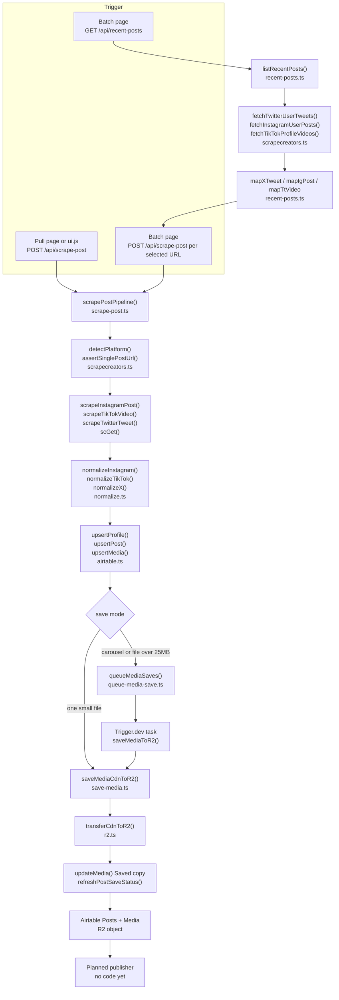
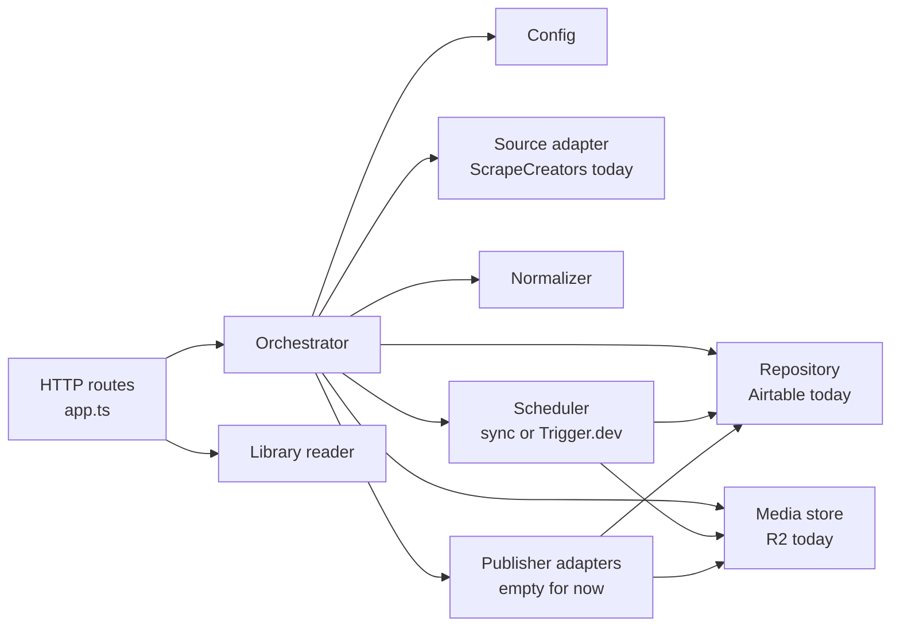

# Architecture review

This note maps **social-hub** as it works today. It is for the person who owns the repo and is still learning how the pieces connect.

No application code was changed for this review. The only new file is this document.

A few words, used the same way every time:

- An **API** is a program you talk to over the network. This repo has its own API, and it also calls other companies' APIs.
- A **route** is one URL on that API, such as `POST /api/scrape-post`.
- An **environment variable** (env var) is a named setting supplied at startup, usually from a `.env` file or the host. This doc lists names only. It never lists secret values.
- A **Worker** is the Cloudflare program that runs the API on the public internet.
- A **CDN URL** is the temporary file link on Instagram, TikTok, or X. Those links expire.
- **Upsert** means "update the row if it already exists, otherwise create it."
- A **module** is a folder of code with one job and a small door (an interface) that the rest of the program uses.

---

## 1. The system from the root

### What it does

You paste a post link, or you pick posts from someone's profile. The app asks **ScrapeCreators** for the post, turns the answer into a stable shape, writes rows to **Airtable**, then copies the video or image onto **Cloudflare R2** so you still have the file after the platform link dies.

Posting that copy back out to your own social accounts is the planned last step. There is no publisher code yet. A search of `apps/` finds no repost, publish, or Composio usage.

ScrapeCreators is a third-party scrape API. It bills in **credits**. A credit is one unit on their account. The project can ask their servers to reuse a cached response (`cache_max_age`), and a cache hit is charged 0 credits. The API is not an unlimited free feed.

### Top-level folders and files

| Path | What it is |
| --- | --- |
| `apps/api` | The real backend. HTTP routes, scrape, Airtable, R2, and the background save task. |
| `apps/api/src/index.ts` | Local entry. Loads `.env` from the repo root and listens on port `8787`. |
| `apps/api/src/worker.ts` | Internet entry. Cloudflare runs this file. |
| `apps/api/src/app.ts` | Every HTTP route lives here (`createApp`). |
| `apps/api/src/lib` | The pipeline: fetch, normalize, database, file copy. |
| `apps/api/src/trigger/save-media-to-r2.ts` | Background job definition for Trigger.dev. |
| `apps/api/src/workflows/save-media.ts` | A Cloudflare Workflow class. Nothing in the HTTP app starts it. |
| `apps/api/public` | Older plain HTML/JS pages: `/`, `/batch`, `/scraps`, `/docs/api`. |
| `apps/api/wrangler.jsonc` | Cloudflare config: Worker name, KV cache, workflow binding, public variable names. |
| `apps/web` | Newer admin site (React + Vite). Local pages: Pull, Batch, Scraps, Usage, Settings, Docs. |
| `apps/web/src/main.tsx` | Browser entry for that admin site. |
| `packages/shared` | A tiny type file. Nothing in `apps/` imports it. |
| `scripts` | One-off commands: dump a raw API response, check Cloudflare, hit the live Worker. |
| `fixtures/scrapecreators` | Saved raw API bodies used for offline runs. |
| `docs` | Notes. Several still describe an older queue (Inngest) that the API no longer calls. |
| `.env.example` | The list of settings you are expected to fill in. Safe to read. |
| `package.json` | Root scripts: `dev`, `dev:api`, `dev:web`, `cf:deploy`. |
| `WORKFLOWS.md` | An older flowchart. Part of it is now wrong (see section 3). |
| `.github/workflows/deploy-cloudflare.yml` | On push to `main`, builds the admin site and deploys the Worker. |

There are two screens for the same API:

1. The React app in `apps/web`. Locally it runs on port `5173` and forwards `/api` to port `8787`.
2. The older pages in `apps/api/public`.

Deploy copies the React build into `apps/api/public/admin` and the Worker serves it at `/admin/`. `npm run cf:deploy` does that copy, then `wrangler deploy`.

### How a run starts

Local, both processes:

```bash
npm run dev
```

That runs `apps/api` (`tsx watch src/index.ts`) and `apps/web` (`vite`) together.

API alone: `npm run dev:api` → `http://127.0.0.1:8787`.

Admin site alone: `npm run dev:web` → `http://127.0.0.1:5173`.

On Cloudflare, a request hits `worker.ts`. That file copies string settings onto `process.env`, forces `RUNTIME=cloudflare`, then calls `createApp()` and handles the request.

Background file copies are started with `queueMediaSaves()` in `apps/api/src/lib/queue-media-save.ts`. That function POSTs to Trigger.dev (`https://api.trigger.dev/api/v2/tasks/batch`) and names the task `save-media-to-r2`.

### Env var names

The app reads these. Values stay out of git (`.env` is gitignored). `.env.example` is the checklist.

| Name | Used for |
| --- | --- |
| `PORT` | Local API port. Default `8787`. |
| `RUNTIME` | Set to `cloudflare` inside the Worker. |
| `SCRAPECREATORS_API_KEY` | ScrapeCreators header `x-api-key`. |
| `SC_MODE` | `cache` (local default), `offline` (fixtures only), or `live`. |
| `SC_VENDOR_CACHE_HOURS` | Sent as `cache_max_age` so a vendor cache hit costs 0 credits. |
| `SC_FIXTURE` | Force one file under `fixtures/scrapecreators/`. |
| `SC_CACHE_WRITE` | `0` turns off writing the local response cache. |
| `SC_CACHE_LOG` | `0` quiets cache log lines. |
| `AIRTABLE_TOKEN` or `AIRTABLE_API_KEY` | Airtable login. Either name works. |
| `AIRTABLE_BASE_ID` | Which Airtable base. |
| `AIRTABLE_POSTS_TABLE` | Posts table id. |
| `AIRTABLE_MEDIA_TABLE` | Media table id. |
| `AIRTABLE_PROFILES_TABLE` | Profiles table id. |
| `AIRTABLE_USAGE_EVENTS_TABLE` | Optional usage log table. |
| `R2_ACCOUNT_ID` | Cloudflare account for R2. |
| `R2_ACCESS_KEY_ID` | R2 key id. |
| `R2_SECRET_ACCESS_KEY` | R2 secret key. |
| `R2_BUCKET` | Bucket name. Default in code and Wrangler: `scrape-kit-media`. |
| `R2_PUBLIC_BASE_URL` | Public base for saved file URLs. |
| `TRIGGER_SECRET_KEY` | Trigger.dev. |
| `LIBRARY_BUST_URL` | Worker URL the background job calls to clear the library cache. |
| `LIBRARY_BUST_SECRET` | Shared password for that one internal route. |
| `VITE_BASE` | Build-time prefix. Deploy uses `/admin/`. |

`.env.example` also lists `COMPOSIO_API_KEY`, `COMPOSIO_USER_ID`, and `COMPOSIO_AIRTABLE_ACCOUNT_ID`. No application code reads them.

Wrangler also sets plain variables in `apps/api/wrangler.jsonc`: `RUNTIME`, `SC_MODE` (`live`), `SC_CACHE_WRITE`, the Airtable base and table ids, and `R2_BUCKET`. `scripts/cf-deploy-secrets.sh` uploads the secret names above. It does not upload `SC_VENDOR_CACHE_HOURS`, so a production scrape does not send `cache_max_age` unless that variable is added by hand.

Old scripts and docs still mention `INNGEST_EVENT_KEY`, `INNGEST_SIGNING_KEY`, and `INNGEST_DEV`. The current API package does not depend on Inngest. Those names are leftovers.

### Outside services

| Service | Role in this repo | Where the code talks to it |
| --- | --- | --- |
| ScrapeCreators (`https://api.scrapecreators.com`) | Fetch one post, a profile feed, or the credit balance. | `apps/api/src/lib/scrapecreators.ts` |
| Airtable | Database for profiles, posts, media, and optional usage events. | `apps/api/src/lib/airtable.ts`, `apps/api/src/lib/usage.ts` |
| Cloudflare R2 | File storage for the permanent copy (S3-compatible). | `apps/api/src/lib/r2.ts` |
| Trigger.dev | Queue for large or multi-file saves. Retries the job. | `apps/api/src/lib/queue-media-save.ts`, `apps/api/src/trigger/save-media-to-r2.ts` |
| Cloudflare Workers + KV | Hosts the API and a 60-second cache of the scraps library. | `apps/api/src/worker.ts`, `apps/api/src/lib/library-cache.ts` |
| Platform CDNs (Instagram, TikTok, X) | Temporary media bytes. | Downloaded by `downloadCdnUrl` / `transferCdnToR2` |

Airtable tables the code writes:

- **Profiles** — handle, platform, avatar, followers.
- **Posts** — caption, link, stats, status, links to media.
- **Media** — one image or video per row, order, CDN link, R2 link, save status.
- **usage_events** — optional. Only if `AIRTABLE_USAGE_EVENTS_TABLE` is set.

---

## 2. Data flow

Two ways in:

- **One post.** Pull page (`apps/web/src/pages/pull.tsx`) or the old home page (`apps/api/public/ui.js`) sends `POST /api/scrape-post`.
- **Many posts.** Batch page (`apps/web/src/pages/batch.tsx`) first calls `GET /api/recent-posts`, then calls `POST /api/scrape-post` once per selected post.



Step by step for one pasted URL:

1. `createApp()` in `app.ts` receives `POST /api/scrape-post` and calls `scrapePostPipeline()`.
2. `detectPlatform()` looks at the hostname. `assertSinglePostUrl()` refuses profile links.
3. `scGet()` calls ScrapeCreators. Local `SC_MODE=cache` can replay a file from `.cache/scrapecreators` or `fixtures/scrapecreators`. On the Worker, `scMode()` always returns `live`, so every scrape hits the network.
4. `normalizeInstagram`, `normalizeTikTok`, or `normalizeX` builds a `NormalizedScrape` (`types.ts`): one post plus a list of media items.
5. `upsertProfile`, `upsertPost`, and `upsertMedia` write Airtable. The post status is set to `Saving` when a copy to R2 will be attempted.
6. One small file is copied inside the same HTTP request (`saveMediaCdnToR2` → `transferCdnToR2`). Several files, or one file whose size looks bigger than 25MB, are queued with `queueMediaSaves()`. The Trigger.dev task calls the same `saveMediaCdnToR2`.
7. R2 upload uses a key like `social-hub/{mediaRecordId}/{timestamp}.ext`. Airtable **File link** stays the CDN URL. **Saved copy** becomes the R2 URL. `refreshPostSaveStatus()` sets the post to `Saved` only when every slide is saved.
8. Reposting is the missing box at the end. Nothing reads the saved copy and publishes it.

The scraps library (`GET /api/scraps` → `listScraps()` in `scraps.ts`) only reads Airtable. It does not scrape.

---

## 3. What is broken or poorly designed

Ordered by how much it hurts scraping, data, or the safety of the account. Each item was checked in the source. The last subsection says what was executed.

### P0 — The public API has no login

Every useful route in `app.ts` runs with no shared secret and no user check. That includes:

- `POST /api/scrape-post` (spends ScrapeCreators credits, writes Airtable, can upload to R2)
- `GET /api/recent-posts` (spends credits)
- `GET /api/scraps` (reads the saved library)
- `POST /api/media/save`, `/api/media/save-sync`, `/api/media/save-unsaved`
- `GET /api/credits` and `GET /api/usage`
- `GET /api/thumb` and `GET /api/media/download`

The README names the deployed Worker host. Anyone who can open that host can call these routes. `GET /health` reports which integrations are configured (`hasAirtable`, `hasR2`, `hasScrapeCreators`, `hasTrigger`). That part does not reveal secret values. It does tell a stranger the account is armed.

The one route that checks a secret is `POST /internal/library-cache/bust` (`isBustAuthorized` in `library-cache.ts`).

Confirmed locally: with an empty environment, `POST /api/scrape-post` and `GET /api/scraps` answered immediately. They failed on missing config, and they did not ask for a password.

### P0 — ScrapeCreators calls do not retry, do not time out, and accept error bodies

`scGet()` in `scrapecreators.ts` (about lines 64–107) is the only door to the vendor.

- The `fetch` has no `AbortSignal.timeout`. A hung vendor call hangs the HTTP request.
- There is no retry and no backoff. A `429` (rate limit) or a `500` throws once and the scrape dies.
- Failure is decided only by HTTP status (`if (!res.ok)`). A JSON body with `success: false` is returned as a normal scrape.

Airtable's own helper does retry. `airtableFetch()` in `airtable.ts` (about lines 53–109) tries 3 times, waits `250 * attempt * attempt` milliseconds, and retries network errors, `429`, and `5xx`. The scrape client does not.

The checked-in Instagram fixture is an error, not a post:

`fixtures/scrapecreators/last-ig-raw.json` is `{ success: false, error: "bad_request", message: "url must be an instagram link" }`.

Ran `scrapeInstagramPost()` in `SC_MODE=offline` with `SC_FIXTURE=last-ig-raw.json`. `scGet` logged a fixture hit and returned that error object. `normalizeInstagram()` then produced a post:

- `postId` taken from the URL (`Cxyz123`)
- `authorHandle` `@unknown`
- `caption` empty
- `media` length 0

If this body arrived with HTTP 200, the pipeline would keep going and could upsert an empty Airtable post. The same normalizer run against `last-x-raw.json` and `last-x-retweet-raw.json` did extract a real post id, handle, and one media file. Those two fixtures are usable. The Instagram one is not.

The batch page adds a second try in the browser (`batch.tsx`, the inner `catch` around `scrapeOnce`). That retry is immediate, one extra full scrape, and it is not a server-side backoff. It can spend a second credit and hit the same rate limit again. The Pull page does not retry at all.

### P0 — A second scrape of a saved post throws away the "saved" flag and downloads again

`scrapePostPipeline()` always writes media with `saveStatusFields("pending")` (`scrape-post.ts`, the `upsertMedia` loop). `upsertMedia()` (`airtable.ts`, about lines 320–336) keeps an existing **Saved copy** URL, and it still patches `saveStatus` to `pending`.

`saveMediaCdnToR2()` skips work only when a Saved copy exists **and** the status is already `saved` (`save-media.ts`, about lines 84–97). After the upsert, the status is `pending`, so the skip does not happen. Every re-scrape downloads the CDN file again.

That matters because CDN links die. The refresh path that asks ScrapeCreators for a new file URL (`freshFileUrlForMedia`) runs only when `mediaOnly` is true (`save-media.ts`, about lines 102–135). The normal scrape and the Trigger.dev task call `saveMediaCdnToR2` without `mediaOnly`. A TikTok URL that expires before the background job runs fails the save, and the job does not fetch a fresh link.

`saveUnsavedMediaForPost()` does refresh first. The main path does not.

Large-file routing can also miss. If `headCdnUrl()` fails, it returns `{}` (`r2.ts`, the `catch` around lines 105–107). The caller treats a missing length as 0, so a big video stays on the synchronous path (`scrape-post.ts`, about lines 152–157) and can die inside the HTTP request. The download itself waits up to 180 seconds and does not retry (`downloadCdnUrl` / `transferCdnToR2`).

### P1 — Profile feeds are a single page, and X is only a sample

`fetchInstagramUserPosts` and `fetchTikTokProfileVideos` accept a cursor. `fetchTwitterUserTweets` (`scrapecreators.ts`, about lines 125–129) does not. `listRecentPosts()` for X returns no `nextCursor`. The code comment in `recent-posts.ts` (about lines 349–351) says X exposes a popular/sample feed, not the full chronological posts.

The batch page never sends `cursor` and never reads `nextCursor` (`batch.tsx`, the `URLSearchParams` in `onFetch`). Instagram and TikTok cursors are dropped on the floor. The user sees at most one vendor page, then at most 24 rows after the filter. There is no "load more."

`listRecentPosts` also filters and sorts in memory, then slices. A page full of text-only posts can come back as an empty media feed even when older posts have media.

### P1 — Parsing is split in two and can invent a shared "unknown" post

Single-post parsing lives in `normalize.ts`. Profile-card parsing lives again in `recent-posts.ts` (`mapXTweet`, `mapIgPost`, `mapTtVideo`). The two copies walk different JSON shapes. A card can look fine in Batch and then fail, or look empty, when the same URL is scraped for real.

If a field is missing, post ids fall back to the string `"unknown"` (`normalizeInstagram`, `normalizeTikTok`, `normalizeX`). `upsertPost()` keys the row on **Post ID**. Two failed parses share one Airtable row and overwrite each other.

`normalizeTikTok()` stores one video URL (the first `play_addr` entry) or, if that is missing, the cover image. Photo carousels are not walked. `normalizeInstagram()` skips a carousel child with no file URL and continues, so slide indexes can gap. `scrapePostPipeline` then renumbers `order` to `0..n-1` while leaving `mediaId` on the old index. A later scrape can create a second media row for the same slide and leave the old row behind.

`assertSinglePostUrl()` rejects `t.co` short links and Instagram stories. `https://t.co/...` is detected as X, then refused because it has no `/status/123`. `vm.tiktok.com` short links are allowed through with no video id check.

### P1 — The library silently stops after the first Airtable page

`listRecords()` requests one page (`airtable.ts`, about lines 133–153). `listPosts(80)`, `listMedia(100)`, and `listProfiles(100)` do not follow `offset`. `listScraps()` joins those three lists (`scraps.ts`, about lines 88–96). Posts and files beyond that first page never show up. `reconcile-media-kind.ts` is the script that does loop on `offset`. The library path does not.

Upserts are find-then-write, one HTTP call at a time, with no lock. Two batch saves of the same URL at the same moment can both miss the existing row and insert duplicates.

### P1 — Four stories about the same save, and only one of them is the live path

What actually saves a file today:

| Path | What it does |
| --- | --- |
| `saveMediaCdnToR2()` inside the HTTP request | Sync copy. This is the path for one small file. |
| `queueMediaSaves()` → Trigger.dev `saveMediaToR2` | Async copy. Task retries 3 times (`save-media-to-r2.ts`). |
| `SaveMediaWorkflow` in `workflows/save-media.ts` | Downloads and uploads to R2. Does not update Airtable. No route creates a workflow instance. `SAVE_MEDIA_WORKFLOW` is declared in `wrangler.jsonc` and exported from `worker.ts`. |
| Inngest `media/cdn.ready` | Described in `WORKFLOWS.md`, `docs/api.md`, `docs/carousel.md`, `docs/media-r2-pipeline.md`, and `README.md` (`npm run dev:inngest`). The route `POST /api/inngest` is gone. `POST /demo/hello` is gone. |

`WORKFLOWS.md` still says there is no `POST /api/scrape-post`. That route exists and is what the UI calls.

The root `package-lock.json` still lists `inngest` for `apps/api`. `apps/api/package.json` depends on `@trigger.dev/sdk` and does not depend on `inngest`. The two lockfiles disagree.

`packages/shared` duplicates a smaller `NormalizedPost` than `apps/api/src/lib/types.ts` and has zero imports from the apps. `heic-convert` is a dependency of `apps/api` and is never imported. The thumb route skips HEIC bytes instead of converting them (`app.ts`, the `.heic` branch in `/api/thumb`).

`apps/api/package.json` also depends on the root package (`"social-hub": "file:../.."`). The root package is the script runner, not a library.

### P2 — Security and leakage besides the missing login

- **Thumb host check is a substring.** `isAllowedThumbHost()` (`app.ts`, about lines 356–371) uses `host.includes("tiktok.com")` and similar `includes` checks. A hostname that merely contains the text `tiktok.com` is allowed. Confirmed: `GET /api/thumb?url=https://not-a-real-tiktok.com/a.jpg` returned `500` and the body `thumb failed`. A forbidden host returns `403` (`https://example.com/a.jpg` did). The `500` means the check let the request through and the download failed. This route can be used as an open proxy toward any host that matches the substring.
- **Errors are sent to the browser.** Catch blocks return `err.message`. The Airtable helper puts the table path in that message. Confirmed: `GET /api/scraps` with no token returned `Airtable GET /tbly36b1qJiRbfEL2?pageSize=100: Missing env var: AIRTABLE_TOKEN`.
- **Airtable formulas escape quotes only.** `formulaEq()` (`airtable.ts`, about lines 114–116) puts the handle into a formula string. `GET /api/avatar?handle=` reaches `findProfile()` with that string. A handle containing a closing brace can change the formula.
- **Resource ids are committed.** Airtable base and table ids have defaults in `airtable.ts`, `wrangler.jsonc`, and `.env.example`. `trigger.config.ts` contains a Trigger.dev project id. `publicBase()` in `r2.ts` (about lines 26–31) falls back to a hardcoded public R2 host when `R2_PUBLIC_BASE_URL` is unset, so a misconfigured process publishes files to that host. No API tokens or private keys were found in git. `.env` is gitignored. `.env.example` has empty secret fields.
- **Usage math is a single page.** `GET /api/usage` sets "credits used" to the sum of `getCreditUsage(1)` only (`app.ts`, about lines 246–250). That is one page of history, then `given = remaining + used`. The number is not the account's real lifetime spend.
- **Worker does not keep background work alive.** `worker.ts` ignores the `ExecutionContext` argument. `recordUsageEvent()` fires a fetch and does not await it (`usage.ts`). On a Worker, that write can be dropped when the response ends. `createApp()` is called on every request (`worker.ts`, the `fetch` handler), and `scrapsInflight` is created inside `createApp`. The "share one in-flight library load" map is empty on every production request.

### P2 — Local cache and production cache disagree

Local default `SC_MODE=cache` stores the vendor JSON on disk with no expiry (`writeCached` / `readCached` in `sc-cache.ts`). The next scrape of the same URL replays that file forever, including dead CDN links.

On Cloudflare, `scMode()` returns `live` whenever `RUNTIME=cloudflare` (`sc-cache.ts`, about lines 17–22), and `worker.ts` also sets `SC_CACHE_WRITE=0`. Production never uses the disk cache. It also does not get `SC_VENDOR_CACHE_HOURS` from the deploy secret list, so it does not ask the vendor for the free cache window unless someone sets that variable in the dashboard.

Same post URLs with different query strings (`?igsh=`, tracking params) are different cache keys and different vendor calls. The pipeline does not strip the query before `scGet`. A later save uses `canonicalPostUrl()` only inside the media-only refresh.

### What was run, and what happened

No ScrapeCreators, Airtable, R2, or Trigger.dev credentials were used. Nothing was deployed.

| Check | Result |
| --- | --- |
| `npm ci --prefix apps/api` | Installed. npm reported 19 vulnerabilities in the tree (1 critical: `tar`, plus highs in packages pulled in by the toolchain, including `trigger.dev` and `undici`). These are dependency advisories, not a reviewed exploit in this app. |
| Test files | None. No `*.test.ts` / `*.spec.ts`. No `npm test` script. |
| `tsc --noEmit` in `apps/api` | Failed. Missing Cloudflare types (`Fetcher`, `ExecutionContext`, `cloudflare:workers`). Real type errors in `r2.ts` (`Referer` can be `undefined`), and in `scrape-post.ts` (`unknown` assigned to `Record<string, unknown>`). The project does not typecheck cleanly. |
| Normalize fixtures with `tsx` | X post fixture and X quote fixture normalized to a real id, handle, and one media file. Instagram fixture normalized to `@unknown` and zero media. |
| `SC_MODE=offline` + `SC_FIXTURE=last-ig-raw.json` calling `scrapeInstagramPost` | Returned `success: false` / `bad_request`. Normalizer still built a post from the URL. |
| API on `127.0.0.1:8787` with secrets unset and `SC_MODE=offline` | Process started. `GET /health` → `200`, all `has*` flags false. `GET /` → `200`. `POST /api/scrape-post` → offline cache miss. `GET /api/recent-posts` → same. `GET /api/credits` → `200` with `remaining: null` and a warning. `GET /api/scraps` → `500` leaking the media table id. `POST /demo/hello` → `404`. `GET /api/inngest` → `404`. Thumb: `example.com` → `403`; `not-a-real-tiktok.com` → `500`. |

`scripts/e2e-cloud.mjs` still scores `POST /demo/hello` as an Inngest check. Against this code that step is a 404. `scripts/.e2e-last.json` is an older run from when Inngest existed. It was not re-run here.

---

## 4. A smaller design

The idea: each box does one job. Callers depend on the door, not on Airtable or ScrapeCreators by name. Adding a second source, or a future "post to X" step, means a new file behind the same door.



### Config

**Job:** Read env vars once at startup. Fail with a clear missing-name error before any scrape. Know `SC_MODE`, timeouts, and which source is active.

**In:** process environment. **Out:** a typed object, for example `{ scrapeCreatorsApiKey, airtableToken, r2, trigger, vendorCacheHours }`.

**Today:** `required()` is copied in `scrapecreators.ts`, `airtable.ts`, and `r2.ts`, and defaults are buried in those files and in `wrangler.jsonc`.

**Swap:** one module. Call sites ask `config.r2.bucket` and never call `process.env` themselves.

### Source adapter

**Job:** Talk to one vendor. Retry, time out, and reject an error body before anyone else sees it.

**In:** a post URL, or a handle plus an optional cursor.

**Out:** the raw JSON plus `{ creditsCharged, creditsRemaining, cached }`, or a thrown `ScrapeError` with a stable code (`rate_limited`, `vendor_error`, `bad_url`).

```ts
interface SourceAdapter {
  id: string;
  fetchPost(url: string): Promise<RawEnvelope>;
  fetchFeed(input: { platform: Platform; handle: string; cursor?: string }): Promise<RawFeed>;
}
```

**Today:** `scGet`, `scrapeInstagramPost`, `scrapeTikTokVideo`, `scrapeTwitterTweet`, `fetchTwitterUserTweets`, `fetchInstagramUserPosts`, `fetchTikTokProfileVideos`.

**Swap:** write another class with the same two methods and register it by `id`. `scrapePostPipeline` keeps calling `source.fetchPost`. A second vendor does not touch Airtable or R2. Platform choice stays inside the adapter (or a tiny router that only looks at the URL). The cache (`sc-cache.ts`) becomes a wrapper around the adapter, with a max age, so local replay cannot live forever.

### Normalizer

**Job:** Turn one vendor's raw JSON into the shared `NormalizedScrape` in `types.ts`. Reject `success: false` and missing ids. Never return post id `"unknown"`.

**In:** `{ platform, url, raw }`. **Out:** `NormalizedScrape`.

**Today:** `normalizeInstagram`, `normalizeTikTok`, `normalizeX`, plus the second set `mapXTweet` / `mapIgPost` / `mapTtVideo`.

**Swap:** one normalizer per platform, used by both the single-post path and the feed path. A feed card is a lighter view of the same function, not a second parser. A new platform is a new function plus a line in a map: `normalizers[platform](raw, url)`.

### Repository

**Job:** Save and load profiles, posts, and media. Hide Airtable formulas, page size, and field names.

**In:** `NormalizedScrape` for writes. Record ids for reads.

**Out:** `{ profileId, postId, media: { id, order, fileUrl }[] }` and list results that follow every page.

```ts
interface LibraryRepository {
  upsertScrapedPost(post: NormalizedScrape): Promise<StoredPost>;
  getMedia(id: string): Promise<StoredMedia>;
  markMedia(id: string, patch: MediaPatch): Promise<void>;
  listScraps(filter: ScrapFilter): Promise<ScrapPage>;
}
```

**Today:** `airtable.ts`, `post-status.ts`, `save-status.ts`, `scraps.ts`.

**Important rule to put in this module:** if a media row is already `saved` and the caller did not pass `force`, leave `saveStatus` and **Saved copy** alone. Re-scraping may refresh caption and stats. It must not schedule another download.

**Swap:** a different database implements the same interface. Routes and the orchestrator stay. Paging (`offset` until it is absent) lives here so the library cannot silently truncate.

### Media store

**Job:** Copy bytes from a URL into durable storage and return a public URL plus the detected kind.

**In:** `{ sourceUrl, key, claimedType }`. **Out:** `{ publicUrl, bytes, contentType, kind }`.

**Today:** `r2.ts` (`transferCdnToR2`, `detectMediaKind`, `isHostedMediaUrl`).

**Swap:** another bucket or disk implements the same function. The retry for a dead CDN link belongs with the orchestrator (ask the source for a fresh URL, then call the store again), and it runs for every save, including Trigger.dev jobs.

### Scheduler

**Job:** Decide "do it now" versus "queue it," and run the copy with retries and backoff.

**In:** a list of `{ mediaRecordId, postRecordId, fileUrl }`. **Out:** `{ mode: "sync" | "async", results }`.

**Today:** the `saveMode` branch in `scrapePostPipeline`, `queueMediaSaves`, and the Trigger.dev task. The unused Cloudflare Workflow should stay out of this door until it also updates Airtable, or it should be removed so there is one queue.

**Swap:** the orchestrator calls `scheduler.enqueue(jobs)`. Trigger.dev is one implementation. A local inline runner is another, used when the file is small or when Trigger.dev is not configured. Callers do not build Trigger.dev HTTP requests themselves.

### Orchestrator

**Job:** The sequence in section 2, and nothing else. Fetch, normalize, save rows, schedule copies, refresh post status.

**In:** `{ url, saveToR2, force }` (the body of `POST /api/scrape-post`). **Out:** the JSON the UI already expects (`ScrapePostResult`).

**Today:** `scrapePostPipeline` in `scrape-post.ts`. It currently imports Airtable, R2, Trigger, normalizers, and ScrapeCreators directly. Avatar saving (`profile-avatar.ts`) should be a step the orchestrator calls, not a second copy of "detect platform, scrape, normalize."

### Publisher adapters

**Job:** Later, take a stored post whose media is already on R2 and publish it to an account you own.

**In:** `{ post: StoredPost, media: StoredMedia[], accountId }`. **Out:** `{ platform, publishedUrl }`.

```ts
interface Publisher {
  platform: "instagram" | "tiktok" | "x";
  publish(input: PublishInput): Promise<PublishResult>;
}
```

**Today:** nothing. Do not build this until the scrape path is reliable. When you add Instagram posting, you add `InstagramPublisher` and register it. The repository, media store, and source adapter stay as they are. The orchestrator grows one call: `publisher.publish(...)`, and only if a future request asks for it.

### HTTP layer

**Job:** Check the body, check the caller, call one function, map errors to status codes. Do not contain scrape logic.

**Today:** `app.ts` is routes plus thumb proxy plus static files plus business rules. After the split, each route is a few lines. A new source does not add a new route. The existing `/api/scrape-post` keeps working.

### Migration plan

Do these in order. Each step leaves the current URLs working.

1. **Lock today's behavior with fixtures.** Add a small test that runs `normalizeX` and `normalizeInstagram` on the files in `fixtures/scrapecreators`. Include the Instagram error file and expect a thrown error, not an `@unknown` post. No credentials. This is the safety net for every later edit.
2. **Make `scGet` honest.** Add a timeout, retry `429` and `5xx` with backoff, and throw when `success` is false. Keep the function name so `scrapePostPipeline` does not need a redesign yet. Set `SC_VENDOR_CACHE_HOURS` in the Worker config so production uses the vendor's free cache window.
3. **Stop clobbering saved rows.** In the upsert, if status is already `saved` and `force` is not set, do not write `pending` and do not download again. On every failed CDN download (`401`, `403`, `404`, `410`), refresh the file URL and try once more. Do this for the Trigger.dev task too, not only `mediaOnly`.
4. **Introduce the interfaces in front of the existing functions.** New files that call the current `scGet`, `normalizeX`, `upsertPost`, and `transferCdnToR2`. Point `scrapePostPipeline` at those wrappers. Behavior stays the same. This is the seam.
5. **Move code behind the seams one module at a time.** Repository first (and teach it to follow Airtable `offset`). Then merge the feed mappers into the normalizer. Then make the scheduler the only thing that knows about Trigger.dev. Delete or clearly mark `workflows/save-media.ts` and the Inngest docs so the next reader has one story.
6. **Protect the routes that spend credits or read the library.** A single shared secret, or a login, checked in the HTTP layer. Return short error codes to the browser. Keep vendor details in server logs.
7. **Teach Batch to follow `nextCursor`.** Fix the X adapter when the vendor actually supports a cursor. Until then, show the "sample feed" note in the UI so a short page is expected.
8. **Add a publisher only after steps 1–3 are in place.** Start with one platform and the `Publisher` interface above. The scrape pipeline should not gain social-network SDK calls inline.

After step 4, a new scrape vendor is a new `SourceAdapter`. A new social network to post to is a new `Publisher`. Neither change should edit the repository or the media store.
